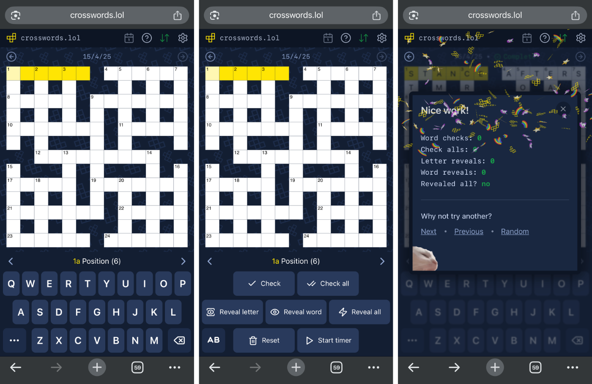

# crosswords.lol

A mobile-focussed crosswords web app, powered by Guardian quick crossword data.

➡️ Check it out: **[https://crosswords.lol](https://crosswords.lol)**

---

## Screenshots

## About

`crosswords.lol` scrapes the [daily quick crossword data](https://www.theguardian.com/crosswords/series/quick) from the source code of the Guardian website and uses it to render a custom, mobile-optimised crossword UI (with a few extra bells and whistles added on top).

Why? Because the Guardian crossword setters are great ❤️ but their website crossword UI kinda sucks on mobile devices and can often be a bit frustrating to use.

So it seemed like a fun little project to try and build a nicer, more mobile-friendly app experience to complement their 👌 clue-setting.

If you enjoy using [crosswords.lol](https://crosswords.lol)  then please consider heading over to [the Guardian website](https://www.theguardian.com/) to donate / subscribe / click on some ads or something. This is all (a bit cheekily) built on their data and it's always nice to say thank you 🙏

## How does it work?

Each [crossword page on the Guardian website](https://www.theguardian.com/crosswords/quick/17104) contains the JSON-encoded crossword data as the attribute value of an HTML tag in the source code. Pretty handy.

So once a day this app requests the latest crossword page in a background job, scrapes the data out of the response, parses it and stores it in the database.

On the frontend, each crossword is rendered using SVG using the scraped data to determine the cell positions and what entry they belong to. The rest of the UI is built with plain vanilla HTML, CSS and a sprinkling of AlpineJS for interactivity.

## Disclaimer

_This is just a fun little side project for personal use and learning_ 😎

It was not built with any intent to lure users away from the Guardian website's crossword pages and will never be monetised via advertising or in any other way.

Things may be broken from time to time when I'm tinkering with new ideas!
